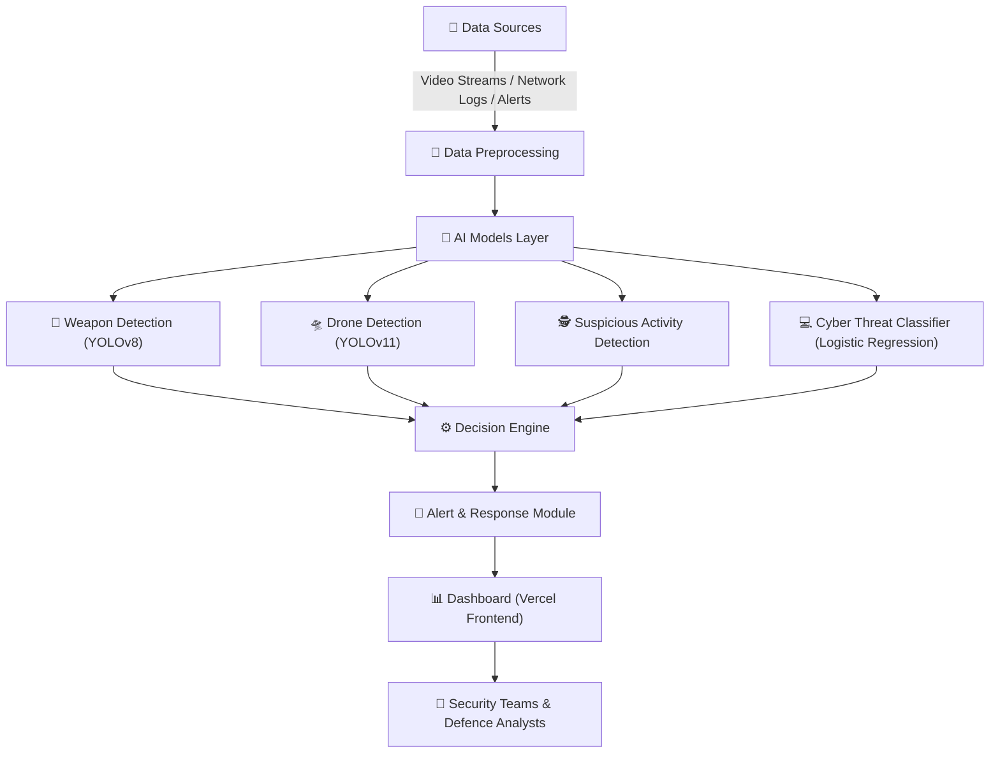

<p align="center">
  
</p>

<p align="center">
  
</p>

<p align="center">
  
  
  
  
  
</p>

<p align="center">
  
</p>

## 🧠 Project Overview

**PakShield Defence AI** is an **AI-powered autonomous defense system** designed to enhance national security through real-time **threat detection and situational awareness**.  
It integrates **drone, weapon, and human detection modules** using advanced computer vision and AI analytics, ensuring **rapid identification of potential threats** at borders and restricted zones.  

🚀 Developed with precision by a skilled team:
- **Afnan Shoukat** – Lead Vision & Integration  
- **Usama Shahid** – Backend & AI Architecture  
- **Dure Addan Noor** – UI & Data Coordination  

🌐 **Live Demo:** [pakshieldai.vercel.app](https://pakshieldai.vercel.app)  
🔗 **LinkedIn:** [Afnan Shoukat](https://linkedin.com/in/afnanshoukat) · [Usama Shahid](https://linkedin.com/in/-usamashahid) · [Dure Addan Noor](https://linkedin.com/in/adannoor)


<p align="center">
  
</p>

## ✨ Key Features


### 🧩 1. AI Threat Intelligence  
> **Smart security at the data layer**

- 📧 **Email Phishing Detection** — Identifies malicious emails and phishing attempts using NLP-based classification.  
- 🛡️ **Network Intrusion Detection** — Monitors network packets and detects abnormal activity patterns using trained ML models.  
- ⚙️ Real-time inference with **FastAPI backend** and **automated alert system** for instant action.  

### 🎥 2. Autonomous Video Surveillance  
> **Eyes that never blink**

- 🔫 **Weapon Detection** — Detects firearms, knives, or other weapons using custom-trained YOLOv8 models.  
- 🧍 **Face Recognition** — Identifies authorized vs. unauthorized individuals with embedding-based recognition.  
- 🚨 **Suspicious Activity Detection** — Flags abnormal behavior using motion trajectory and object analysis.  
- 🤖 **Anomaly Detection** — AI-driven pattern recognition for detecting irregular or unexpected visual events.  
- 🧩 Modular FastAPI endpoints for each vision model — optimized for real-time edge deployment.  


### 🌍 3. Border Anomaly Detection  
> **Defending the unseen borders**

- 🚁 **Drone Detection** — Uses aerial object recognition model (`best.pt`) for identifying drones in real-time.  
- 🌙 **Thermal Human Detection** — Detects human presence in night vision or thermal camera feeds.  
- 🕵️ **Suspicious Movement Tracking** — Tracks movement patterns to differentiate humans, animals, or machines.  
- 🗄️ Lightweight model integration supporting YOLOv11 transfer learning and custom datasets.  

<p align="center">
  
</p>

## 🏗️ Architecture / System Design

**PakShield AI** follows a **modular multi-agent architecture** that integrates real-time defense analytics, video surveillance intelligence, and cyber threat detection under one unified framework.

### 🧩 System Overview



### ⚙️ Components Breakdown

* **Data Sources** – Real-time feeds from surveillance cameras, drones, and network activity logs.
* **Preprocessing Engine** – Cleans, formats, and synchronizes data for model input.
* **AI Models Layer** – Deep learning modules for detection and classification.
* **Decision Engine** – Integrates multi-model outputs to evaluate threat levels.
* **Alert & Response Module** – Sends notifications and generates reports.
* **Dashboard (Vercel)** – Frontend for real-time visualization and management.

<p align="center">
  
</p>

## ⚙️ Tech Stack

PakShield AI is engineered using a **hybrid tech ecosystem** that unifies real-time video intelligence, cyber threat analytics, and multi-agent AI coordination. Each layer of the stack is optimized for performance, scalability, and modular integration.

### 🧠 **Artificial Intelligence & Machine Learning Stack**

Here’s your updated table including **Face Recognition** and **Anomaly Detection** modules 👇

| Module                                | Model / Technique                  | Description                                                  |
| ------------------------------------- | ---------------------------------- | ------------------------------------------------------------ |
| 🔫 **Weapon Detection**               | YOLOv8                             | Real-time firearm & object detection from surveillance feeds |
| 🛸 **Drone Detection**                | YOLOv11                            | Detects low-flying UAVs from border and restricted zones     |
| 🧍 **Thermal Human Detection**        | CNN (Custom)                       | Identifies human silhouettes in thermal imagery at night     |
| 🕵️ **Suspicious Activity Detection** | Custom Anomaly Classifier          | Flags irregular human or vehicle behaviors                   |
| 🧑‍💻 **Cyber Threat Analysis (IDS)** | Logistic Regression, Decision Tree | Classifies phishing attempts and intrusion patterns          |
| 📧 **Email Phishing Classifier**      | NLP + TF-IDF                       | Filters fraudulent emails and phishing attempts              |
| 🧠 **Face Recognition**               | FaceNet / OpenCV                   | Identifies and verifies individuals from surveillance video  |
| ⚠️ **Anomaly Detection**              | Autoencoder + Statistical Models   | Detects unusual patterns across multi-sensor border data     |


### 🧬 **Integration Summary**

```
[Python AI Modules] → [FastAPI Backend APIs] → [Next.js Frontend] → [Vercel Dashboard] → [Defense Operations Unit]
```
<p align="center">
  
</p>

## 🚀 Installation & Setup

### 🔧 Prerequisites

* Python 3.10+
* Node.js 18+
* Git
* Virtual Environment (optional but recommended)
---

### ⚙️ Backend Setup (Flask + ML Models)

```bash
# Clone the repository
git clone https://github.com/fewgets/PakShieldAI.git
cd PakShieldAI/Backend

# Create virtual environment
python -m venv venv
source venv/Scripts/activate     # On Windows
# or
source venv/bin/activate         # On Mac/Linux

# Install dependencies
pip install -r requirements.txt

# Run backend API
python api.py
```

---

### 💻 Frontend Setup (Next.js)

```bash
cd ../Frontend

# Install dependencies
npm install

# Configure backend API in:
public/config/config.js

# Run the frontend
npm run dev
```

---

### 🌍 Access the App

Once both servers are running:

* **Frontend:** [http://localhost:3000](http://localhost:3000)
* **Backend API:** [http://127.0.0.1:8000](http://127.0.0.1:8000)

<p align="center">
  
</p>

## 🧩 Usage Guide

### 🧠 How to Use

#### **1️⃣ Launch the System**

* Start the backend API (`api.py`)
* Run the frontend via Next.js (`npm run dev`)
* Access the web interface at: `http://localhost:3000`

#### **2️⃣ Upload / Stream Inputs**

* 🧍 Upload **thermal or surveillance video** to detect humans at night.
* 🛸 Stream **drone or aerial footage** for UAV detection.
* 🔫 Submit **weapon footage** for automatic firearm identification.
* 📧 Provide **email samples or logs** for phishing classification.

### 🖼️ Screenshots

| Module                            |                                              Preview                                              |
| :-------------------------------- | :-----------------------------------------------------------------------------------------------: |
| **Weapon Detection (YOLOv8)**     |          |
| **Drone Detection (YOLOv11)**     |            |
| **Thermal Human Detection (CNN)** |  |
| **Face Recognition**              |       |
| **Dashboard Interface (Next.js)** |                       |


## 👥 Contributors

| Name               | Role                         | GitHub                                 | Email                                                       |
| ------------------ | ---------------------------- | -------------------------------------- | ----------------------------------------------------------- |
| **Usama Shahid**   | Backend Lead / AI Engineer   | [@fewgets](https://github.com/fewgets) | [shaikhusama541@gmail.com](mailto:shaikhusama541@gmail.com) |
| **Afnan**          | AI Research & Model Training | —                                      | —                                                           |
| **Team PakShield** | Research & Integration       | —                                      | —                                                           |

---

## 🤝 Collaboration & Contact

📬 **Reach Us for Collaboration:**
Interested in partnerships, defense AI research, or deployment?
Email us at: **[shaikhusama541@gmail.com](mailto:shaikhusama541@gmail.com)**

💻 **Request Training Code:**
For model reproduction or retraining requests, reach out via email or submit a GitHub issue.

---

## 🧩 License

This project is released under the **MIT License** — allowing use, modification, and distribution with attribution.

---

## 🏁 Acknowledgements

Special thanks to **URAAN Pakistan Techathon** for providing the platform to bring *Pak Shield AI* to life as part of the **SurakhshaAI Defense Challenge**.

> *Protecting borders. Preventing threats. Powering defense with intelligence.*
