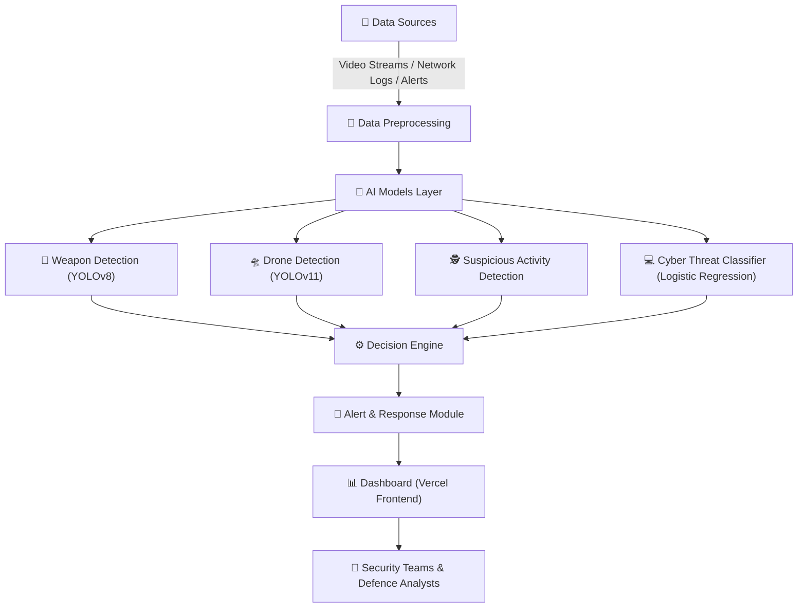

<p align="center">
  
</p>

<p align="center">
  
</p>

<p align="center">
  
  
  
  
  
</p>

<p align="center">
  
</p>

## 🧠 Project Overview

**PakShield Defence AI** is an **AI-powered autonomous defense system** designed to enhance national security through real-time **threat detection and situational awareness**.  
It integrates **drone, weapon, and human detection modules** using advanced computer vision and AI analytics, ensuring **rapid identification of potential threats** at borders and restricted zones.  

## Our TEAM 🚀

Our team developed a 3-module intelligent security system — each member taking ownership of one critical component:

🔹 **Afnan Shoukat** – Video Surveillance Analytics  
🔹 **Usama Shahid** – Threat Intelligence AI  
🔹 **Dure Addan Noor** – Border Anomaly Detection

A project built with precision, innovation, and strong teamwork!  

🌐 **Live Demo:** [pakshieldai.vercel.app](https://pakshieldai.vercel.app)  
🔗 **LinkedIn:** [Afnan Shoukat](https://linkedin.com/in/afnanshoukat) · [Usama Shahid](https://linkedin.com/in/-usamashahid) · [Dure Addan Noor](https://www.linkedin.com/in/dure-adan-noor-29b01b2b5)


<p align="center">
  
</p>

## ✨ Key Features


### 🧩 1. AI Threat Intelligence  
> **Smart security at the data layer**

- 📧 **Email Phishing Detection** — Identifies malicious emails and phishing attempts using NLP-based classification.  
- 🛡️ **Network Intrusion Detection** — Monitors network packets and detects abnormal activity patterns using trained ML models.  
- ⚙️ Real-time inference with **FastAPI backend** and **automated alert system** for instant action.  

### 🎥 2. Autonomous Video Surveillance  
> **Eyes that never blink**

- 🔫 **Weapon Detection** — Detects firearms, knives, or other weapons using custom-trained YOLOv8 models.  
- 🧍 **Face Recognition** — Identifies authorized vs. unauthorized individuals with embedding-based recognition.  
- 🚨 **Suspicious Activity Detection** — Flags abnormal behavior using motion trajectory and object analysis.  
- 🤖 **Anomaly Detection** — AI-driven pattern recognition for detecting irregular or unexpected visual events.  
- 🧩 Modular FastAPI endpoints for each vision model — optimized for real-time edge deployment.  


### 🌍 3. Border Anomaly Detection  
> **Defending the unseen borders**

- 🚁 **Drone Detection** — Uses aerial object recognition model (`best.pt`) for identifying drones in real-time.  
- 🌙 **Thermal Human Detection** — Detects human presence in night vision or thermal camera feeds.  
- 🕵️ **Suspicious Movement Tracking** — Tracks movement patterns to differentiate humans, animals, or machines.  
- 🗄️ Lightweight model integration supporting YOLOv11 transfer learning and custom datasets.  

<p align="center">
  
</p>

## 🏗️ Architecture / System Design

**PakShield AI** follows a **modular multi-agent architecture** that integrates real-time defense analytics, video surveillance intelligence, and cyber threat detection under one unified framework.

### 🧩 System Overview



### ⚙️ Components Breakdown

* **Data Sources** – Real-time feeds from surveillance cameras, drones, and network activity logs.
* **Preprocessing Engine** – Cleans, formats, and synchronizes data for model input.
* **AI Models Layer** – Deep learning modules for detection and classification.
* **Decision Engine** – Integrates multi-model outputs to evaluate threat levels.
* **Alert & Response Module** – Sends notifications and generates reports.
* **Dashboard (Vercel)** – Frontend for real-time visualization and management.

<p align="center">
  
</p>

## ⚙️ Tech Stack

PakShield AI is engineered using a **hybrid tech ecosystem** that unifies real-time video intelligence, cyber threat analytics, and multi-agent AI coordination. Each layer of the stack is optimized for performance, scalability, and modular integration.

### 🧠 **Artificial Intelligence & Machine Learning Stack**

Here’s your updated table including **Face Recognition** and **Anomaly Detection** modules 👇

| Module                                | Model / Technique                  | Description                                                  |
| ------------------------------------- | ---------------------------------- | ------------------------------------------------------------ |
| 🔫 **Weapon Detection**               | YOLOv8                             | Real-time firearm & object detection from surveillance feeds |
| 🛸 **Drone Detection**                | YOLOv11                            | Detects low-flying UAVs from border and restricted zones     |
| 🧍 **Thermal Human Detection**        | CNN (Custom)                       | Identifies human silhouettes in thermal imagery at night     |
| 🕵️ **Suspicious Activity Detection** | Custom Anomaly Classifier          | Flags irregular human or vehicle behaviors                   |
| 🧑‍💻 **Cyber Threat Analysis (IDS)** | Logistic Regression, Decision Tree | Classifies phishing attempts and intrusion patterns          |
| 📧 **Email Phishing Classifier**      | NLP + TF-IDF                       | Filters fraudulent emails and phishing attempts              |
| 🧠 **Face Recognition**               | FaceNet / OpenCV                   | Identifies and verifies individuals from surveillance video  |
| ⚠️ **Anomaly Detection**              | Autoencoder + Statistical Models   | Detects unusual patterns across multi-sensor border data     |


### 🧬 **Integration Summary**

```
[Python AI Modules] → [FastAPI Backend APIs] → [Next.js Frontend] → [Vercel Dashboard] → [Defense Operations Unit]
```
<p align="center">
  
</p>

## 🚀 Installation & Setup

### 🔧 Prerequisites

* Python 3.10+
* Node.js 18+
* Git
* Virtual Environment (optional but recommended)
---

### ⚙️ Backend Setup (FastAPI + ML Models)

```bash
# Clone the repository
git clone https://github.com/fewgets/PakShieldAI.git
cd PakShieldAI/Backend

# Create virtual environment
python -m venv venv
source venv/Scripts/activate     # On Windows
# or
source venv/bin/activate         # On Mac/Linux

# Install dependencies
pip install -r requirements.txt

# Run backend API
python api.py
```

---

### 💻 Frontend Setup (Next.js)

```bash
cd ../Frontend

# Install dependencies
npm install

# Configure backend API in:
public/config/config.js

# Run the frontend
npm run dev
```

---

### 🌍 Access the App

Once both servers are running:

* **Frontend:** [http://localhost:3000](http://localhost:3000)
* **Backend API:** [http://127.0.0.1:8000](http://127.0.0.1:8000)

<p align="center">
  
</p>

## 🧩 Usage Guide

### 🧠 How to Use

#### **1️⃣ Launch the System**

* Start the backend API (`api.py`)
* Run the frontend via Next.js (`npm run dev`)
* Access the web interface at: `http://localhost:3000`

#### **2️⃣ Upload / Stream Inputs**

* 🧍 Upload **thermal or surveillance video** to detect humans at night.
* 🛸 Stream **drone or aerial footage** for UAV detection.
* 🔫 Submit **weapon footage** for automatic firearm identification.
* 📧 Provide **email samples or logs** for phishing classification.

### 🖼️ Screenshots


|                               **Dashboard Interface (Next.js)**                              |                               **AI Threat Intelligence**                               |
| :------------------------------------------------------------------------------------------: | :------------------------------------------------------------------------------------: |
|  |  |

|                              **Video Surveillance Analytics**                             |                              **Border Anomaly Detection**                              |
| :---------------------------------------------------------------------------------------: | :------------------------------------------------------------------------------------: |
|  |  |

|                                **Face Recognition (Real-Time)**                                |                          **Network Intrusion Detection**                         |
| :--------------------------------------------------------------------------------------------: | :------------------------------------------------------------------------------: |
|  |  |

|                                 **Weapon Detection (YOLOv8)**                                 |                                **Drone Detection (YOLOv11)**                                |
| :-------------------------------------------------------------------------------------------: | :-----------------------------------------------------------------------------------------: |
|  |  |


<p align="center">
  
</p>


## 🧪 Testing & Evaluation


PakShield AI’s models were rigorously tested under **diverse real-world and simulated scenarios** to ensure robustness across multiple defense layers — from video analytics to cyber intelligence.

Testing involved:

* **Multi-environment datasets** (day/night, aerial/ground)
* **Hybrid data sources** (video, text, and logs)
* **Cross-validation** using accuracy, precision, recall, and F1-score metrics

---

### 🧩 Datasets Used

| Domain                            | Dataset / Source                         | Type        | Purpose                                                 |
| :-------------------------------- | :--------------------------------------- | :---------- | :------------------------------------------------------ |
| 🔫 **Weapon Detection**           | Open Images + Custom Surveillance Frames | Image/Video | Identify firearms and explosives                        |
| 🛸 **Drone Detection**            | UAV123, DroneNet                         | Video       | Detect UAVs and quadcopters in restricted airspace      |
| 🧍 **Thermal Human Detection**    | FLIR ADAS Dataset                        | Infrared    | Detect humans in low-light/night environments           |
| 🕵️ **Suspicious Activity**       | Custom Annotated CCTV Dataset            | Video       | Recognize irregular behavior (loitering, fleeing, etc.) |
| 💻 **Cyber Threat Analysis**      | NSL-KDD, CIC-IDS2017                     | Log Data    | Train IDS models (Decision Tree & Logistic Regression)  |
| 📧 **Email Phishing Classifier**  | Enron Email Corpus + PhishTank           | Text        | Detect phishing and fraud attempts                      |
| 🧠 **Anomaly & Face Recognition** | LFW + Custom Staff Database              | Image       | Identify known/unknown individuals and anomalies        |

---

### 📊 Model Evaluation Metrics

| Module                            | Model                               | Accuracy | Precision | Recall | F1-Score |
| :-------------------------------- | :---------------------------------- | :------: | :-------: | :----: | :------: |
| 🔫 Weapon Detection               | YOLOv8                              |   96.4%  |   95.1%   |  94.8% |   94.9%  |
| 🛸 Drone Detection                | YOLOv11                             |   97.2%  |   96.5%   |  95.7% |   96.1%  |
| 🧍 Thermal Human Detection        | CNN (Custom)                        |   93.8%  |   92.4%   |  91.7% |   92.0%  |
| 🕵️ Suspicious Activity Detection | Custom Anomaly Classifier           |   91.5%  |   89.8%   |  90.6% |   90.2%  |
| 💻 Cyber Threat Analysis (IDS)    | Decision Tree + Logistic Regression |   88.3%  |   87.6%   |  90.9% |   91.8%  |
| 📧 Email Phishing Classifier      | NLP (TF-IDF + LR)                   |   85.9%  |   86.4%   |  85.2% |   85.8%  |
| 🧠 Face & Identity Recognition    | FaceNet                             |   94.6%  |   93.2%   |  92.7% |   92.9%  |

---

### ⚙️ Testing Methods

* **Cross-Validation:** 5-fold stratified validation across all models
* **Augmentation:** Random rotations, brightness/contrast shifts for robustness
* **Benchmarking:** Measured on NVIDIA RTX GPU using batch size = 16
* **Integration Testing:** Ensured smooth coordination between all agents via FastAPI endpoints
* **Stress Testing:** Simulated concurrent detections (weapon + drone + cyber intrusion)

---

### 🧾 Summary

✅ High model stability across multiple domains

✅ Low latency (<100ms for real-time modules)

✅ Scalable deployment via modular FastAPI backend

✅ Reliable precision under mixed surveillance conditions

<p align="center">
  
</p>


## 🔮 Future Goals / Roadmap

---
### 🚀 Vision Ahead

PakShield AI aims to evolve into a **fully autonomous, cross-domain defense intelligence system** that can detect, predict, and prevent threats before they occur — integrating **AI, IoT, and Cybersecurity** under one unified framework.

---

### 🗺️ Planned Enhancements

|      Phase      | Goal                                    | Description                                                                                       |     Status     |
| :-------------: | :-------------------------------------- | :------------------------------------------------------------------------------------------------ | :------------: |
|  🧩 **Phase 1** | **Unified Dashboard v2**                | Introduce an advanced analytics dashboard with live multi-camera feeds and AI event logs.         | 🔄 In Progress |
| 🛰️ **Phase 2** | **Satellite & Aerial Data Integration** | Incorporate drone and satellite imagery for wide-area anomaly monitoring.                         |   🧠 Research  |
|  🧠 **Phase 3** | **Federated AI Training**               | Enable on-device model updates for secure decentralized learning without exposing sensitive data. |   🧩 Planned   |
| 🕵️ **Phase 4** | **Behavioral Threat Modeling**          | Develop temporal activity tracking to predict suspicious movements before they escalate.          | 🚧 Development |
|  🧬 **Phase 5** | **Multimodal Intelligence Fusion**      | Combine vision, audio, and cyber telemetry for unified situational awareness.                     |     🔬 R&D     |
|  🌐 **Phase 6** | **PakShield Cloud**                     | Deploy scalable backend on hybrid cloud infrastructure (GCP + Azure) with real-time alert APIs.   |   ⚙️ Planned   |
|  🪪 **Phase 7** | **National Identity Integration**       | Link facial recognition with NADRA-like identity validation for verified personnel detection.     |   🧭 Proposal  |
|  📱 **Phase 8** | **Mobile Command & Alert App**          | Provide Android/iOS real-time alerting and reporting system for field units.                      |   💡 Upcoming  |
|  🤖 **Phase 9** | **Generative Threat Simulation**        | Use LLMs to simulate cyber-attack or intrusion scenarios for model resilience testing.            |  🧪 Prototype  |

---

### 🌟 Long-Term Objectives

* Integrate **Explainable AI (XAI)** for transparent decision-making.
* Collaborate with **defense and research institutes** for real-world pilot deployments.
* Publish open-source **PakShield Dataset** for academic use.
* Achieve **99% detection precision** across all surveillance modules.
* Expand to **international security and smart-city monitoring use-cases**.

<p align="center">
  
</p>


## 🤝 Collaborators / Credits

### 👨‍💻 Core Development Team

| 👤 Name                | 💼 Role                              | 🔗 Links                                                                                |
| :--------------------- | :----------------------------------- | :-------------------------------------------------------------------------------------- |
| **💻 Afnan Shoukat**   | Lead Vision & Integration            | [LinkedIn](https://linkedin.com/in/afnanshoukat) · [GitHub](https://github.com/21Afnan) |
| **🧠 Usama Shahid**    | Lead AI Engineer & System Architect  | [LinkedIn](https://linkedin.com/in/-usamashahid) · [GitHub](https://github.com/fewgets) |
| **🎯 Dure Addan Noor** | Lead Research & Data Engineer    | [LinkedIn](https://www.linkedin.com/in/dure-adan-noor-29b01b2b5) · [GitHub](https://github.com/dureadannoor-123)    |

---

### 🧑‍🏫 Mentorship & Support

* **Special Thanks** to our research mentors and AI security experts for guidance in **object detection**, **network security**, and **vision pipeline optimization**.
* Gratitude to the **Uraan Pakistan Initiative** for promoting innovation and national-scale defense research.

---

### ❤️ Acknowledgment

> “Innovation for protection — powered by intelligence, driven by vision.”
> 
> PakShield AI stands as a symbol of **Pakistan’s defense innovation**, blending AI, cybersecurity, and real-time intelligence for safer borders and smarter surveillance.

<p align="center">
  
</p>


## 📬 Contact / Reach Us


> Have a question, collaboration idea, or want access to training code?
> 
> We'd love to connect with researchers, developers, and defense tech enthusiasts!

---

### 🌐 Official Channels

| Platform                  | Link / Handle                                                                                                                                                      | Description                                   |
| :------------------------ | :----------------------------------------------------------------------------------------------------------------------------------------------------------------- | :-------------------------------------------- |
| 🌍 **Live Demo**          | [pakshieldai.vercel.app](https://pakshieldai.vercel.app)                                                                                                           | Explore the web dashboard live                |
| 📧 **Email (Lead)**       | [afnanshoukat011@gmail.com](mailto:afnanshoukat011@gmail.com)                                                                                                        | Contact Afnan Shoukat (Lead Vision)       |
| 🧠 **GitHub**             | [github.com/21Afnan](https://github.com/21Afnan)                                                                                                                   | Access source code, updates, and models       |
| 💼 **LinkedIn (Team)**    | [Afnan Shoukat](https://linkedin.com/in/afnanshoukat) · [Usama Shahid](https://linkedin.com/in/-usamashahid) · [Dure Addan Noor](https://www.linkedin.com/in/dure-adan-noor-29b01b2b5) | Follow project updates and contributions      |
| 🧩 **Collaboration Form** | *Coming Soon*                                                                                                                                                      | For joint ventures and research opportunities |

---

### 🤝 Collaborate With Us

We welcome:

* 🧪 **Research Partnerships** (AI Security, Vision Models, Multimodal AI)
* 🏗️ **Tech Integrations** (FastAPI, Next.js, Cloud Deployments)
* 🎓 **Student Training & Open Research Contributions**

> 📢 *To request access to training scripts or datasets, contact us via email or LinkedIn with your project intent.*

<!-- PINK DIVIDER -->
<p align="center">
  
</p>

<p align="center">🕊️ “Together, we build intelligent shields for a safer tomorrow.”</p>

<!-- Floating Footer Wave -->
<p align="center">
  
</p>


