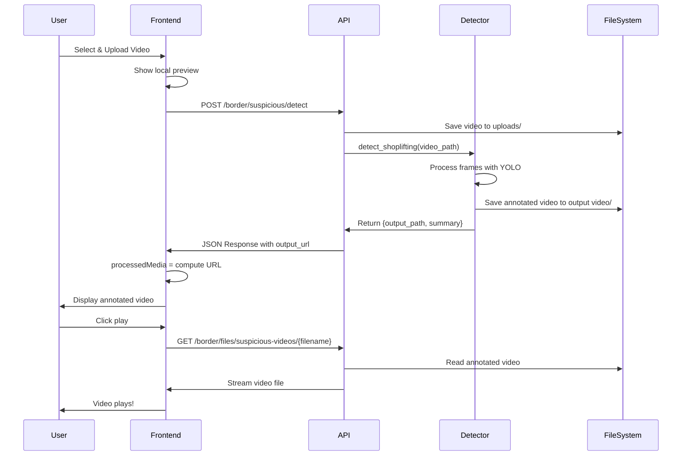

# Suspicious Activity Detection - Complete Flow Documentation

## 🔄 Complete Data Flow

### 1. Frontend Upload → Backend Processing → Frontend Display



## 📍 File Locations

### Backend Directories
```
E:\Documents\Projects\UraanPakistan\Backend\BorderAnomly\Suspicious_Activity_Detection_master\
├── uploads/              → Input videos (uploaded by user)
├── output video/         → Annotated videos (processed results)
├── logs/                 → Detection summary JSON files
└── best.pt              → YOLO model weights
```

### URL Mapping
| Category | URL Path | Physical Directory |
|----------|----------|-------------------|
| Input videos | `/border/files/suspicious-inputs/{filename}` | `uploads/` |
| Output videos | `/border/files/suspicious-videos/{filename}` | `output video/` |
| Summary logs | `/border/files/suspicious-logs/{filename}` | `logs/` |

## 🎯 Backend API Response Structure

### POST `/border/suspicious/detect`

**Request:**
```http
POST /border/suspicious/detect HTTP/1.1
Content-Type: multipart/form-data

file: <video file>
```

**Response (200 OK):**
```json
{
  "status": "success",
  "filename": "test_video.mp4",
  "summary": {
    "frames_processed": 360,
    "frames_with_events": 45,
    "detections_total": 78,
    "alert_events": 45,
    "suspicious_percentage": 12.5,
    "labels_detected": ["person", "shoplifting"]
  },
  "labels": ["person", "shoplifting"],
  "stats": {
    "input_video_url": "/border/files/suspicious-inputs/test_video_20251013T120000.mp4",
    "output_size_bytes": 5242880
  },
  "output_url": "/border/files/suspicious-videos/test_video_20251013T120000_output.mp4",
  "video_url": "/border/files/suspicious-videos/test_video_20251013T120000_output.mp4",
  "log_url": "/border/files/suspicious-logs/test_video_20251013T120000_summary.json"
}
```

## 🎨 Frontend Flow

### 1. Upload Handler (`handleUpload`)
```typescript
// Line ~405-480
const handleUpload = async (file: File) => {
  setIsUploading(true)
  
  // Send to API
  const response = await fetch(endpoint, { method: "POST", body: formData })
  const data = await response.json()
  
  // Save response
  setUploadResponse(data)  // → Triggers processedMedia computation
}
```

### 2. Processed Media Computation (`processedMedia`)
```typescript
// Line ~268-280
const processedMedia = useMemo(() => {
  const rawOutput = uploadResponse?.output_url
  // e.g., "/border/files/suspicious-videos/test_output.mp4"
  
  const absoluteUrl = `${apiBase}${rawOutput}`
  // e.g., "http://localhost:8002/border/files/suspicious-videos/test_output.mp4"
  
  return { url: absoluteUrl, type: "video" }
}, [apiBase, uploadResponse])
```

### 3. Display Logic (Upload Tab)
```typescript
// Line ~577-620
{processedMedia ? (
  <div className="mt-4 space-y-2">
    <p>Detection Result</p>
    {processedMedia.type === "image" ? (
      
    ) : (
      <video src={processedMedia.url} controls />
    )}
  </div>
) : isUploading && uploadType === "video" ? (
  // Show large loading spinner
) : uploadUrl ? (
  // Show local preview
) : null}
```

## 🧪 Testing Steps

### 1. Manual Test via UI
1. Open http://localhost:3000/border-security/suspicious-activity
2. Click **"Upload"** tab
3. Select a video file (`.mp4`)
4. You'll see:
   - Local preview first
   - Then large loading spinner (while processing)
   - Then annotated video result

### 2. Test via API (Python)
```python
import requests

url = "http://localhost:8002/border/suspicious/detect"
files = {'file': open('test.mp4', 'rb')}
response = requests.post(url, files=files)
print(response.json())

# Access the output video
output_url = response.json()['output_url']
video_response = requests.get(f"http://localhost:8002{output_url}")
with open('result.mp4', 'wb') as f:
    f.write(video_response.content)
```

### 3. Test via curl
```bash
# Upload and get response
curl -X POST http://localhost:8002/border/suspicious/detect \
  -F "file=@test_video.mp4"

# Download the result (use output_url from response)
curl -o result.mp4 http://localhost:8002/border/files/suspicious-videos/test_video_output.mp4
```

## ✅ Verification Checklist

- [ ] Backend running on port 8002
- [ ] Frontend running on port 3000
- [ ] Upload directory exists: `Backend/BorderAnomly/Suspicious_Activity_Detection_master/uploads/`
- [ ] Output directory exists: `Backend/BorderAnomly/Suspicious_Activity_Detection_master/output video/`
- [ ] Model file exists: `Backend/BorderAnomly/Suspicious_Activity_Detection_master/best.pt`
- [ ] File serving endpoint works: `GET /border/files/suspicious-videos/{filename}`
- [ ] Frontend shows loading spinner during processing
- [ ] Frontend displays result video after completion
- [ ] Metrics panel shows correct statistics

## 🐛 Common Issues & Solutions

### Issue: "File not found" when accessing video
**Cause:** Output video wasn't created
**Solution:** 
- Check backend logs for errors
- Verify YOLO model is loaded correctly
- Ensure output directory has write permissions

### Issue: Video loads but doesn't play
**Cause:** Browser doesn't support codec
**Solution:**
- Check video codec (should be `mp4v`)
- Try different browser
- Verify video file is not corrupted

### Issue: Response has output_url but video doesn't display
**Cause:** URL not being computed correctly
**Solution:**
- Check browser console for `processedMedia` logs
- Verify `apiBase` is set to `http://localhost:8002`
- Check CORS headers if accessing from different domain

### Issue: Loading spinner never ends
**Cause:** Request failed but error not caught
**Solution:**
- Check browser Network tab for failed requests
- Look for errors in backend logs
- Verify video file is valid format

## 📊 Expected Behavior Summary

| State | What User Sees | What's Happening |
|-------|---------------|------------------|
| File Selected | Local video preview | File loaded into browser memory |
| Uploading | Large loading spinner + "Processing Video Frames..." | Video being sent to backend |
| Processing | Same loading spinner | Backend running YOLO on each frame |
| Complete | Annotated video with play controls | Result video displayed from server |
| Metrics | "Suspicious Percentage: X%" panel | Summary statistics from detection |

## 🔍 Debug Logs to Check

### Backend Logs
```
[INFO] Loading YOLO model from ...
[INFO] Opening video: ...
[INFO] Preparing output file: ...
[INFO] Starting detection...
[INFO] Detection finished.
✅ Detection complete, saved at ...
INFO: 127.0.0.1:XXXXX - "POST /border/suspicious/detect HTTP/1.1" 200 OK
```

### Frontend Console Logs (Added)
```
[BorderModule] API Response: {status: "success", ...}
[BorderModule] output_url: /border/files/suspicious-videos/...
[BorderModule] processedMedia: rawOutput = /border/files/suspicious-videos/...
[BorderModule] processedMedia: final URL = http://localhost:8002/border/files/suspicious-videos/...
```

## 🎯 Success Criteria

1. ✅ Video upload completes without errors
2. ✅ Backend returns JSON with `output_url` field
3. ✅ `processedMedia` computes to valid URL
4. ✅ Video element appears in Upload tab with "Detection Result" label
5. ✅ Clicking play starts the annotated video
6. ✅ Metrics panel shows frame counts and suspicious percentage
7. ✅ Detected labels appear as colored badges
